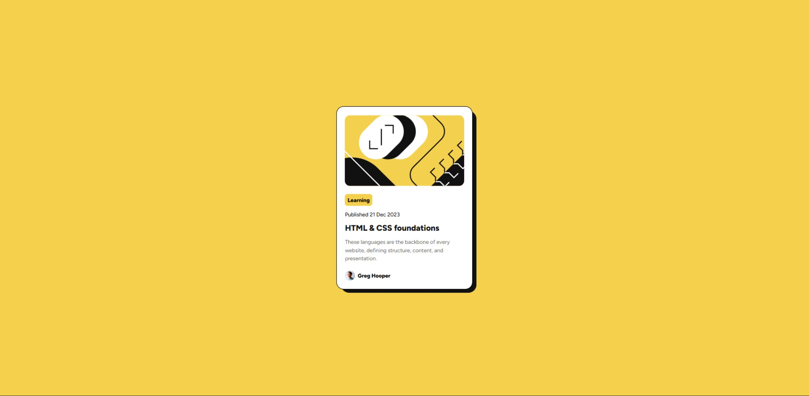

# Frontend Mentor | Blog Preview Card
 
## ✨ Overview

### 🖼️ Project Screenshot

### 🔗 Project Links
Solution: [Open](https://www.frontendmentor.io/solutions/used-html5-css3grid-google-font-vars-and-aria-for-accessibility-h8Hc-YXhw1)

Live Site: [Open](https://gleaming-cocada-5b6140.netlify.app/)

### ✍ My Process

This project is a responsive blog preview card, created as part of a Frontend Mentor challenge. The goal was to replicate a given design while ensuring clean code, accessibility, and responsive design.

#### Technologies & Techniques Used:

- **HTML5:**
    - Used semantic elements like `<section>`, `<time>` to enhance structure and accessibility.
    - Improved readability and SEO by using `<time datetime="YYYY-MM-DD">` for dates.
- **CSS3:**
    - Implemented CSS Grid and Flexbox to create a structured and responsive layout.
    - Used CSS variables `:root` for colors, making the design more maintainable.
    - Applied a shadow effect using the `::before` pseudo-element, to create a layered 3D effect.
- **Accessibility Enhancements:** 
    - Added meaningful alt attributes for images.
    - Used ARIA attributes `aria-label` to improve navigation for screen readers.
    - Ensured proper color contrast for better readability.
- **Responsive Design:** 
    - Used a mobile-first approach with media queries to adapt the layout for different screen sizes.
    - Defined max-width constraints to improve readability on larger screens.
- **Different Measurement Units:** Used a mix of `px` (fixed sizes) and `rem`(relative sizes) for better scalability and accessibility.

This project helped improve CSS layout skills, semantic HTML usage, and accessibility best practices. 🚀

## 👨‍💻 Autor

Gabriel Andrade  
[GitHub](https://github.com/4ndradeGabriel)  
[LinkedIn](https://www.linkedin.com/in/andradegabrielw)  

---

Desenvolvido por [Gabriel Andrade](https://github.com/4ndradeGabriel)